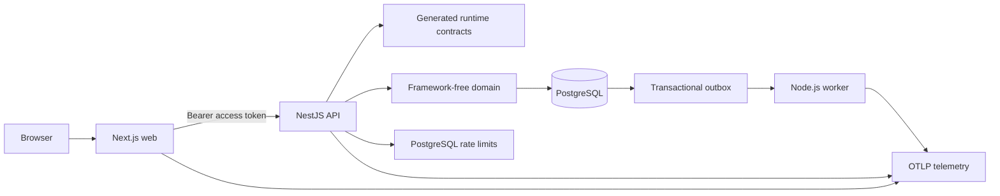

# Nx Fullstack Platform

Nx Fullstack Platform is a production-minded TypeScript workspace template for application teams that want a Next.js web application, a NestJS API, a PostgreSQL-backed worker, shared contracts, validated configuration, structured generation, and production-shaped delivery checks in one Nx monorepo.

It is intended for developers creating a product workspace, application teams making product changes, platform engineers integrating infrastructure, repository administrators configuring GitHub, and operators preparing or supporting production.

> **Important:** A generated workspace that starts locally, passes preview, publishes images, or passes digest promotion is **not automatically production-ready**. The adopting team still owns identity-provider integration, production data services, secrets, telemetry, deployment infrastructure, rollback, disaster recovery, and operational support.

## What the platform includes

- A Next.js App Router web application.
- A NestJS HTTP API with generated runtime contract enforcement.
- A Node.js worker that consumes a PostgreSQL transactional outbox.
- Framework-free Agent Task and rate-limit libraries.
- Shared contracts, generated clients and validators, PostgreSQL migrations, environment validation, and observability.
- Nx project graph, caching, affected commands, architectural boundary checks, and local generators.
- Production image builds, local preview, smoke tests, performance budgets, SBOMs, Trivy policy, Cosign signatures, GitHub attestations, immutable release manifests, and production configuration validation.
- Versioned template releases and downstream upgrade tooling.

## What it does not include

The template does not provide an organization-specific production deployment, Kubernetes manifests, identity-provider login/callback/logout implementation, production session store, Redis worker adapter, model-provider integration, managed backups, DNS/TLS, dashboards, alert routing, or incident ownership. Supported profiles can record some directions without implementing them.

## Start here

1. [Choose workspace profiles](Choosing-Workspace-Profiles).
2. [Complete the Quick Start](Quick-Start).
3. [Tour the repository](Repository-Tour) and inspect the Nx graph.
4. [Learn everyday development](Everyday-Development) and [code generation](Code-Generation).
5. Configure [Repository and GitHub Setup](Repository-and-GitHub-Setup).
6. Review [Image Supply Chain](Image-Supply-Chain) and [Production Readiness](Production-Readiness) before release.

## Common tasks

| Task | Page |
| --- | --- |
| Create and run a workspace | [Quick Start](Quick-Start) |
| Select initialization profiles | [Choosing Workspace Profiles](Choosing-Workspace-Profiles) |
| Understand apps and packages | [Repository Tour](Repository-Tour) |
| Run lint, tests, builds, and affected checks | [Everyday Development](Everyday-Development) |
| Generate domains, features, jobs, and contracts | [Code Generation](Code-Generation) |
| Configure repository controls and environments | [Repository and GitHub Setup](Repository-and-GitHub-Setup) |
| Configure identity | [Authentication and Authorization](Authentication-and-Authorization) |
| Manage PostgreSQL and migrations | [Database and Data Management](Database-and-Data-Management) |
| Operate background jobs | [Worker and Background Jobs](Worker-and-Background-Jobs) |
| Understand `pnpm check` and focused validation | [Validation and Testing](Validation-and-Testing) |
| Build and test production-shaped images | [Containers and Preview Environments](Containers-and-Preview-Environments) |
| Inspect SBOMs, scans, signatures, and attestations | [Image Supply Chain](Image-Supply-Chain) |
| Publish, promote, roll back, or upgrade | [Releases and Upgrades](Releases-and-Upgrades) |
| Prepare for launch | [Production Readiness](Production-Readiness) |
| Diagnose a failure | [Troubleshooting](Troubleshooting) |

## By role

### Evaluating the template

Read [Architecture](Architecture), [Repository Tour](Repository-Tour), and [Choosing Workspace Profiles](Choosing-Workspace-Profiles).

### Creating a workspace

Follow [Quick Start](Quick-Start), then complete [Repository and GitHub Setup](Repository-and-GitHub-Setup).

### Developing applications

Use [Everyday Development](Everyday-Development), [Code Generation](Code-Generation), [Validation and Testing](Validation-and-Testing), and the closest `AGENTS.md`.

### Configuring infrastructure

Use [Authentication and Authorization](Authentication-and-Authorization), [Database and Data Management](Database-and-Data-Management), [Containers and Preview Environments](Containers-and-Preview-Environments), [Image Supply Chain](Image-Supply-Chain), and [Production Readiness](Production-Readiness).

### Operating production

Use [Worker and Background Jobs](Worker-and-Background-Jobs), [Image Supply Chain](Image-Supply-Chain), [Releases and Upgrades](Releases-and-Upgrades), [Production Readiness](Production-Readiness), and [Troubleshooting](Troubleshooting).

## System overview

The web calls the API through generated client code. The API validates contracts, authenticates and authorizes, executes framework-free behavior, and writes application data plus outbox events transactionally. The worker leases outbox records, processes at least once, and uses fencing and idempotency to make duplicate or stale delivery safe.

## Source of truth

The wiki reorganizes end-user guidance from implementation and maintained repository documentation. When a statement conflicts with code, use the implementation and open a documentation correction. The [Documentation Audit](Documentation-Audit) records verification and known gaps.

## Next steps

1. [Choose Workspace Profiles](Choosing-Workspace-Profiles)
2. [Quick Start](Quick-Start)
3. [Repository and GitHub Setup](Repository-and-GitHub-Setup)

